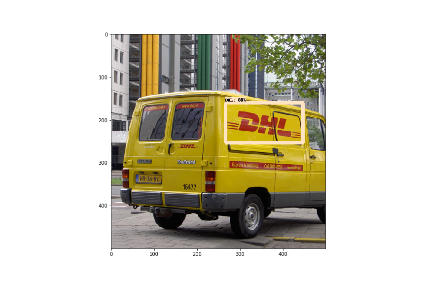

DeepLogo
---
A brand logo detection system using tensorflow object detection API.

### Examples

Belows are detection examples.





### Usage

1. Setup the tensorflow object detection API. First of all, 
   clone the tensorflow/models repository. 
   ```
   $ git clone https://github.com/tensorflow/models.git
   $ cd models/research/object_detection
   $ wget http://download.tensorflow.org/models/object_detection/ssd_inception_v2_coco_2018_01_28.tar.gz
   $ tar zxvf ssd_inception_v2_coco_2018_01_28.tar.gz
   ```
   For detailed steps to setup, please follow the [installation](https://github.com/tensorflow/models/blob/master/research/object_detection/g3doc/installation.md).
2. Clone the DeepLogo repository.
   ```
   $ git clone https://github.com/satojkovic/DeepLogo.git
   ```
3. Download dataset from [flickr_27_logos_dataset](http://image.ntua.gr/iva/datasets/flickr_logos/) and extract.
   ```
   $ cd DeepLogo
   $ wget http://image.ntua.gr/iva/datasets/flickr_logos/flickr_logos_27_dataset.tar.gz
   $ tar zxvf flickr_logos_27_dataset.tar.gz
   $ cd flickr_logos_27_dataset
   $ tar zxvf flickr_logos_27_dataset_images.tar.gz
   $ cd ../
   ```
4. Preprocess original annotation file and generate <u>flickr_logos_27_dataset_training_set_annotation_cropped.txt</u> and <u>flickr_logos_27_dataset_test_set_annotation_cropped.txt</u>. These two files are used to generate tfrecord files.
   ```
   $ cd DeepLogo
   $ python preproc_annot.py
   ```
5. Generate tfrecord files.
   ```
   $ python gen_tfrecord.py --train_or_test train --csv_input flickr_logos_27_dataset/flickr_logos_27_dataset_training_set_annotation_cropped.txt --img_dir flickr_logos_27_dataset/flickr_logos_27_dataset_images --output_path train.tfrecord
   $ python gen_tfrecord.py --train_or_test test --csv_input flickr_logos_27_dataset/flickr_logos_27_dataset_test_set_annotation_cropped.txt --img_dir flickr_logos_27_dataset/flickr_logos_27_dataset_images --output_path test.tfrecord
   ```
6. Training logo detector using pre-trained SSD.
   ```bash
   $ ln -s <OBJECT_DETECTION_API_DIR>/ssd_inception_v2_coco_2018_01_28 ssd_inception_v2_coco_2018_01_28
   $ python <OBJECT_DETECTION_API_DIR>/legacy/train.py --logtostderr --pipeline_config_path=ssd_inception_v2.config --train_dir=training
   ```
   <OBJECT_DETECTION_API_DIR> is the absolute path of models/research/object_detection at step1.

7. Export as pb file.  
   ```
   $ python <OBJECT_DETECTION_API_DIR>/export_inference_graph.py --input_type=image_tensor --pipeline_config_path=ssd_inception_v2.config --trained_checkpoint_prefix=model.ckpt-<STEPS> --output_directory=logos_inference_graph
   ```
   \<STEPS> is the steps at training, for example model.ckpt-1234.

8. Testing logo detector.  
   ```
   $ python logo_detection.py --model_name logos_inference_graph/ --label_map flickr_logos_27_label_map.pbtxt --test_annot_text flickr_logos_27_dataset/flickr_logos_27_dataset_test_set_annotation_cropped.txt --test_image_dir flickr_logos_27_dataset/flickr_logos_27_dataset_images --output_dir detect_results
   ```

### Evaluation

First, modify num_examples field in training/pipeline.config file.

```
eval_config: {
  num_examples: 438
  # Note: The below line limits the evaluation process to 10 evaluations.
  # Remove the below line to evaluate indefinitely.
  max_evals: 10
}
```

This value is from flickr_logos_27_dataset_test_set_annotation_cropped.txt file.

```bash
$ wc -l flickr_logos_27_dataset/flickr_logos_27_dataset_test_set_annotation_cropped.txt 
     438 flickr_logos_27_dataset/flickr_logos_27_dataset_test_set_annotation_cropped.txt
```

Then start evaluation process by using eval.py provided within tensorflow/models repository.

```
$ python <OBJECT_DETECTION_API_DIR>/legacy/eval.py --logtostderr --checkpoint_dir=training --eval_dir=eval --pipeline_config_path=training/pipeline.config
```

After a while you will get evaluation results. If you want to check the results visually, open tensorboard in your browser.

```bash
$ tensorboard --logdir=eval/
```

### License

MIT
